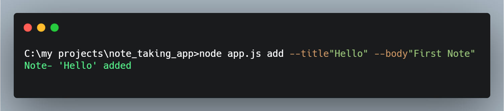
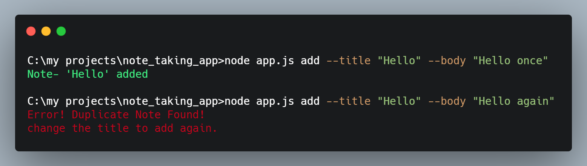
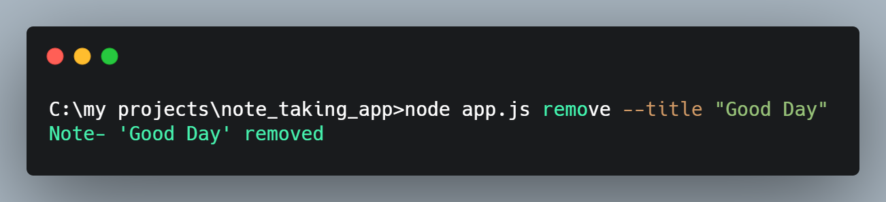
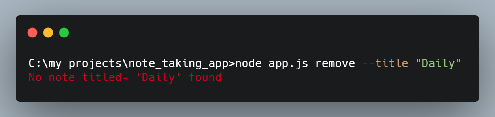
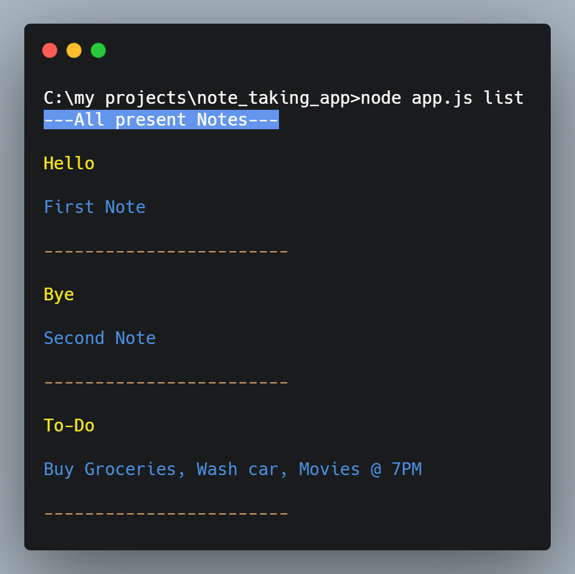
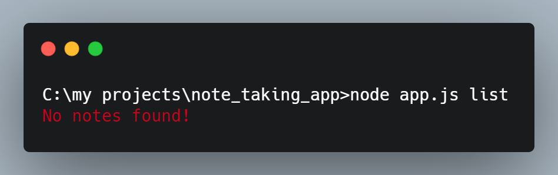
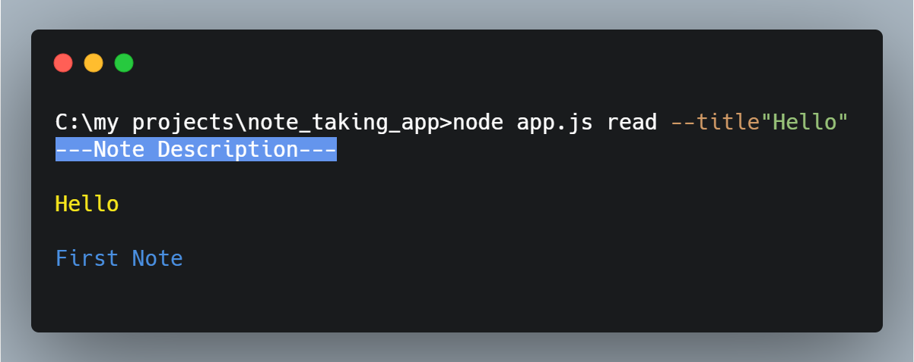
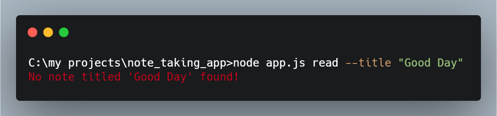

<h1 align="center">
<br>
<a title="https://gitlab.gnome.org/jimmac, GPLv3 &lt;http://www.gnu.org/licenses/gpl-3.0.html&gt;, via Wikimedia Commons" href="https://commons.wikimedia.org/wiki/File:GNOME_Notes_icon_2018.svg"></a>
<br>
  Note Taking app
  <br>
</h1>

<h4 align="center">A basic note taking app made using node.js</h4>

<div align="center">
<code></code>
<code></code>
</div>
<p align="center">
  <a href="#screenshots">Screenshots</a> •
  <a href="#how-to-use">How To Use</a> •
  <a href="#license">License</a>
</p>


## Screenshots
- Adding a Note 

<br>
- Adding a Note with duplicate title

<br>
- Removing a Note

<br>
- Removing a Note that isn't there

<br>
- List all Notes

<br>
- Listing Notes when file is empty

<br>
- Read a Note

<br>
- Reading a Note that isn't there

<br>

## How To Use
Assuming you have <a href= "https://nodejs.org/en/">Node.js</a> already installed in your system.
Clone this repository and run app.jsg<br>
From your command line:

```bash
# Clone this repository
$ git clone https://github.com/shivang02/note_taking_app

# Go into the repository
$ cd note_taking_app

# Run the app
$ npm install 
```
After that you can add, remove, list, read notes as per your wish.

## License

MIT

---

> GitHub &nbsp;&middot;&nbsp; [@shivang02](https://github.com/shivang02)
